# American Time Use Survey (ATUS) Analysis
## - Sheldon Sebastian

*Time is the only true unit of measure. It gives proof to the existence of matter. Without time, we don't exist.*

The American Time Use Survey (ATUS) is the Nation’s first federally administered, *continuous survey on time use in the United States.* The goal of the survey is to measure how people divide their time among life’s activities.

In ATUS, individuals are randomly selected from a subset of households that have completed their eighth and final month of interviews for the Current Population Survey (CPS). ATUS respondents are interviewed only one time about how they spent their time on the previous day, where they were, and whom they were with. The survey is sponsored by the Bureau of Labor Statistics and is conducted by the U.S. Census Bureau.

The major purpose of ATUS is to develop nationally representative estimates of how people spend their time. The *inspiration* behind this project analysis is to understand how daily activities differ by employment status, income, gender, etc.

## Analysis

### 1. Which is most performed activity based on Time spent and Frequency of doing it?

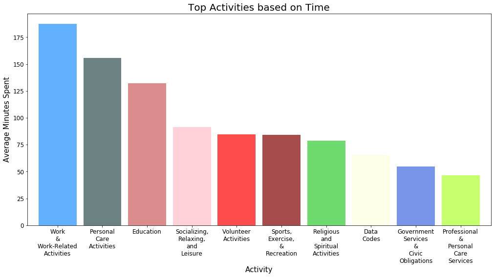

Based on the above bar chart we notice, that most time spent doing an activity is work or work-related activities, followed by personal care activities which include grooming tasks, followed by education category which includes learning or taking classes, followed by socializing and relaxing activities.

### 2. On the basis of activities, where do respondents spend most of their time?

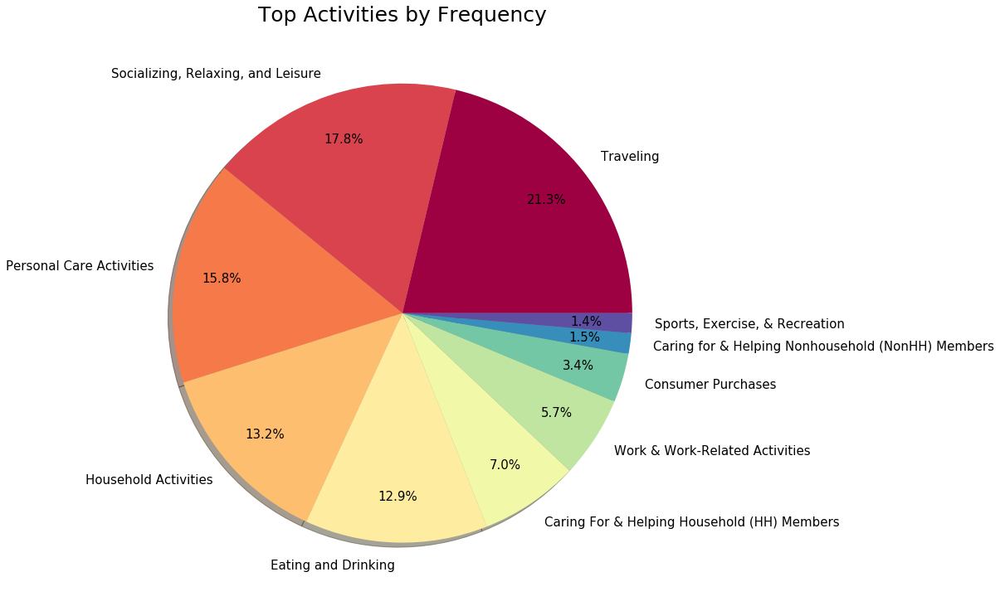

Based on the above pie chart we notice, that the most frequent activity is Traveling, followed by Socializing, Personal Care Activities, Household activities, and Eating and Drinking activities.

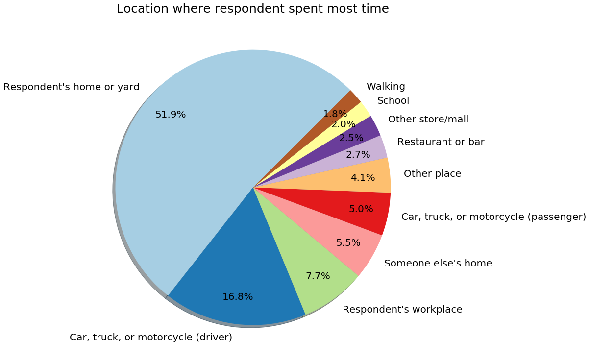

On examining the above pie chart we learn that respondents perform a majority of activities at home, followed by driving in a vehicle, being at the workplace, being at someone else's home.

### 3. How do respondents spend their time based on employment status?

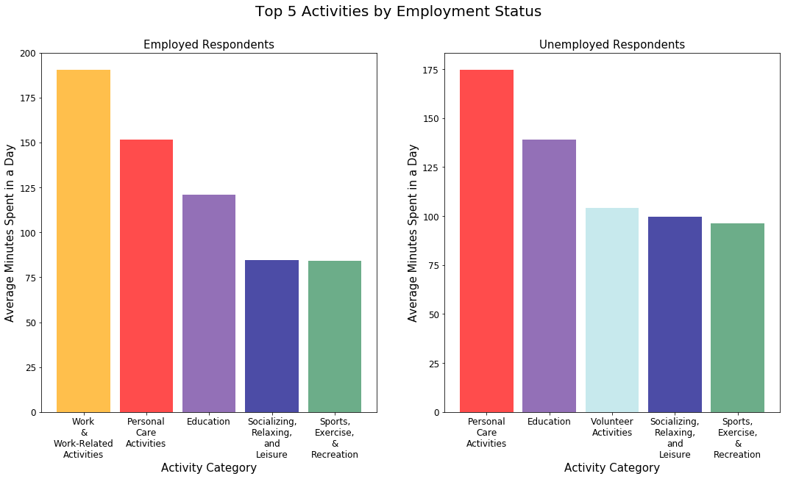

From the above subplot, we notice that employed respondent spends most of their time doing work-related activities, whereas an unemployed respondent spends most of their time doing personal care activities. We also notice that unemployed respondents spend significant amount of time doing volunteering activities.

### 4. How do respondents in different industries spend their time?

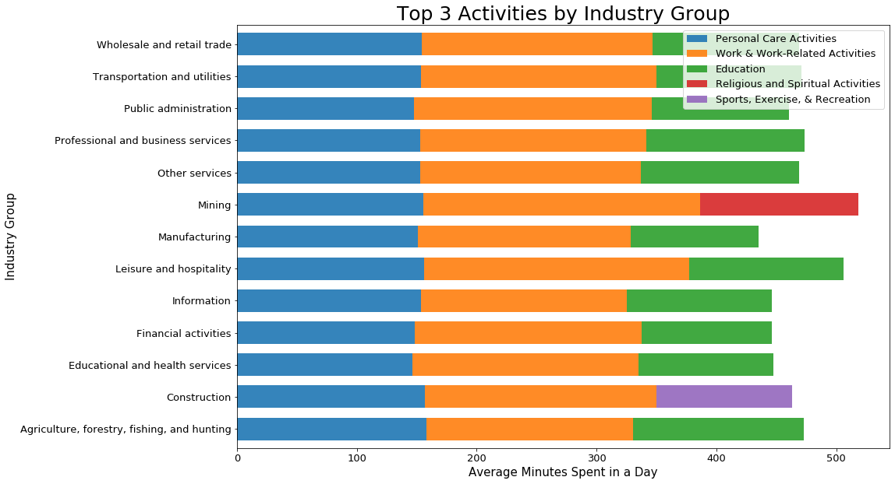

From the above charts, we notice that all industries have the top 3 activities as Personal Care, Work, Education, except for Mining and Construction industries. In the mining industry, the top 3 activities are personal care, work, and religious activities, and for construction industry personal care, work and Sports, Exercise and recreational activities were top 3.

We also observe that respondents from mining and hospitality industries spend more time working in comparison to other industries.

### 5. How do respondents spend their time, and with whom based on marital status?

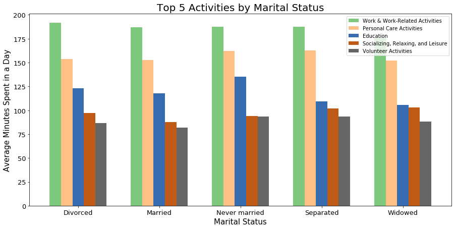

We notice that respondents who have never been married spend most of their time in educational activities, whereas married respondents spend least amount of time in volunteering activities.

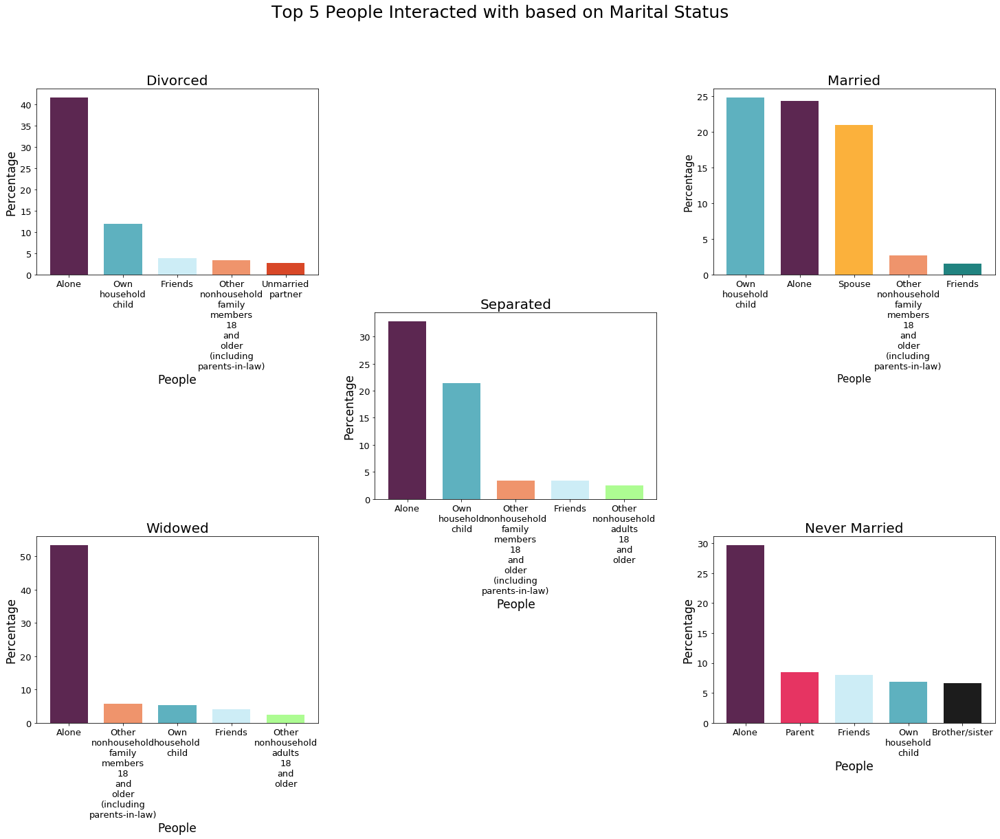

Based on above subplots we notice that Widowed respondents spend most of their time alone. Married respondents spend majority of their time with household kids and spouse. Never married respondents spend most of their time alone followed by time spent with their parents.

### 6. How do respondents in different income categories spend their time?

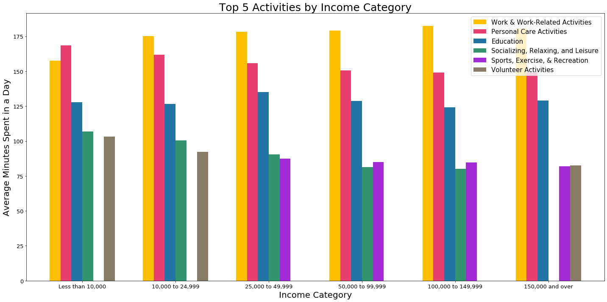

From the above charts, we notice that people who earn less than 10,000 dollars annually spend most of their time on personal activities and the least time on work-related activities. Also, the top 5 activities of Work, Personal Care, Education, Socializing and Sports are common for respondents who earn between 25,000 to 150,000. People who earn more than 150,000 dollars have volunteering activities instead of socializing activities in their top 5 activities.

### 7. How do respondents in different age categories spend their time?

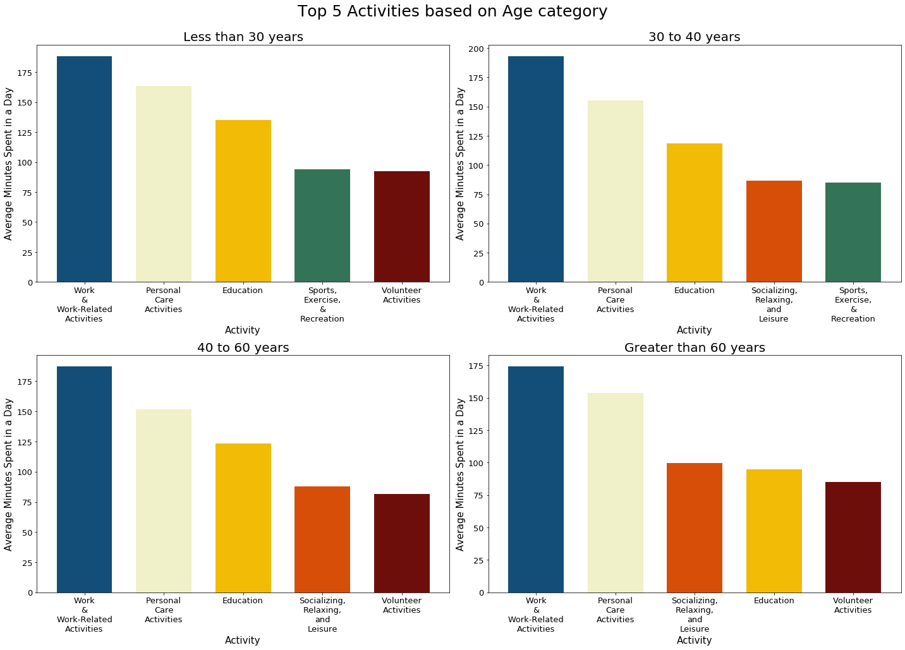

On examining the above subplots we learn that the top 5 activities based on age category are Work, Personal care, socializing, education and volunteering activities. We notice that respondents above 60 years don't do a lot of sports and exercise. Also, respondents below 30 years spend the highest amount of time in education and don't do a lot of socializing/ relaxing activities.

### 8.  How do respondents spend their time, and with whom do they spend it based on gender?

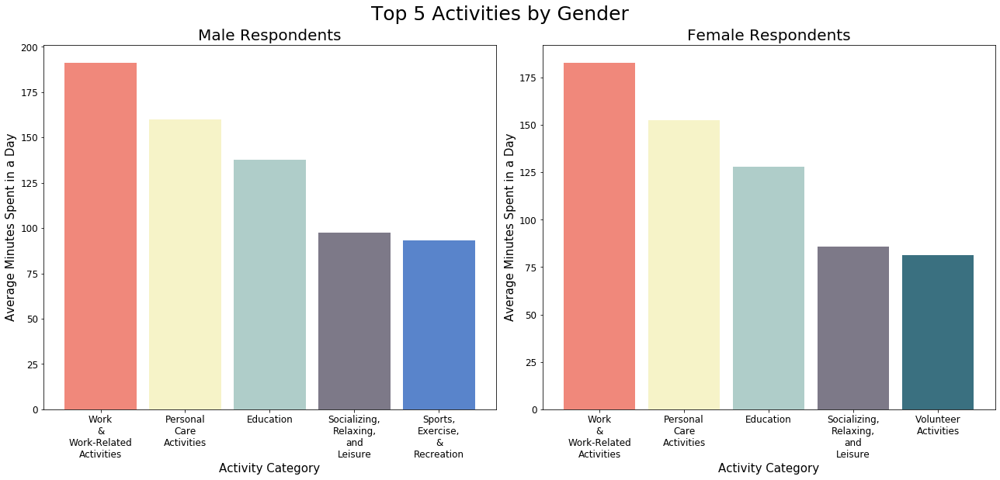
We observe that work, personal care, education, socializing are common for both men and women as their top activities, but men have sports activities as one of their top activities whereas women have volunteering activities as one of their top activities.

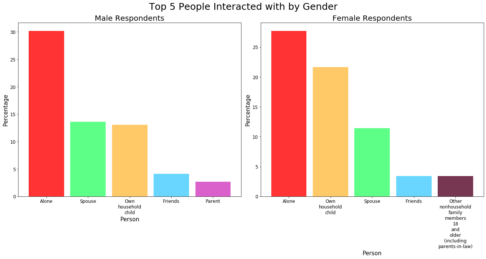
From above charts we notice that male and female respondents spend most of their time alone, but the second person most interacted with for male are their spouse and for female its their own child. Male also interact often with their parents, and females interact with household members older than 18 years(including parent-in-law).

## Conclusion

To summarize from our analysis we found that most time spent doing an activity is work or work-related, followed by personal care which include grooming tasks, education which includes learning or taking classes and, socializing and relaxing activities. The most frequent activity is traveling, socializing, personal care, household, eating and drinking activities. We discovered that respondents perform majority of tasks at home, while driving in a vehicle,at workplace, at someone else's home.

Employed respondent spends most of their time doing work-related activities, whereas an unemployed respondent spends most of their time doing personal care activities. In the mining industry, the top 3 activities are personal care, work, and religious activities, and for construction industry personal care, work and Sports, Exercise and recreational activities were top 3. We also observe that respondents from mining and hospitality industries spend more time working in comparison to other industries.

We notice that respondents who have never been married spend most of their time in educational activities, whereas married respondents spend least amount of time in volunteering activities. Widowed respondents spend most of their time alone in comparison with other marital status respondents. Married respondents spend majority of their time with household kids and spouse. 

People who earn less than 10,000 dollars annually spend most of their time on personal activities and the least time on work-related activities. Also, the top 5 activities of Work, Personal Care, Education, Socializing and Sports are common for respondents who earn between 25,000 to 150,000. People who earn more than 150,000 dollars have volunteering activities instead of socializing activities in their top 5 activities.

Respondents below 30 years spend the highest amount of time in education and don't do a lot of socializing/ relaxing activities. 

We observe that work, personal care, education, socializing are common for both men and women as their top activities, but men have sports activities as one of their top activities whereas women have volunteering activities as one of their top activities. Male and female respondents spend most of their time alone, but the second person most interacted with for male are their spouse and for female its their own child.

Results of analysis for this project can be useful in making policies, set time limits, etc for the American demography.

------------------------

Check the following link for video explanation:

[Link to Jupyter Notebook](https://github.com/sheldonsebastian/American-Time-Use-Survey-Analysis/blob/master/American%20Time%20Use%20Survey%20Analysis.ipynb)
